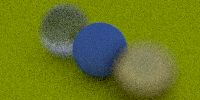

# PandaRay

try to write a ray tracing renderer with modern c++14

## Current Output

## Progress

- [x] vec3  
- [x] ray  
- [x] sphere  
- [x] sphere tHit position
- [ ] I combined material to shape part, it is a bad design and should be changed
- [ ] cmake files  
- [ ] multi-thread

## Notes (for myself)

- use `g++ -std=c++14 -o a.out -I ../src ../src/*/*.cpp` to build all *.cpp files, yes
- use `convert output.ppm output.jpg` to convert image type